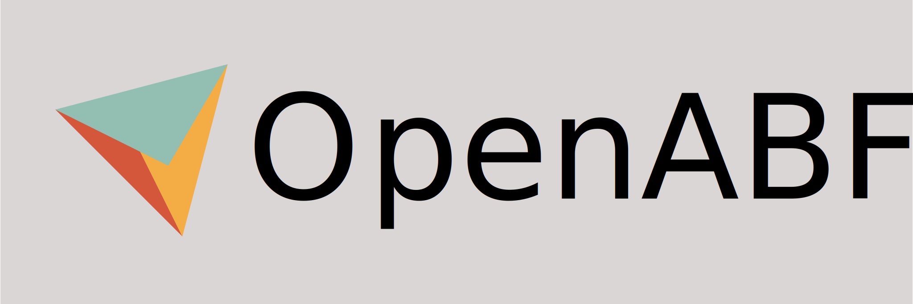

[](https://gitlab.com/educelab/OpenABF)

**OpenABF** is A header-only library of angle-based flattening algorithms for 
C++. It is designed to be as simple as possible to integrate into existing 
projects.

## Requirements
* [Eigen 3.3+](http://eigen.tuxfamily.org/)

## Installation
### CMake
This project is configured and installed using the CMake build system:

```shell
mkdir build
cmake -S . -B build/
cmake --install build/
```

This will install the OpenABF header(s) to your default system path and provide 
an easy method to link OpenABF against your own CMake project:

```cmake
# Find OpenABF libraries
find_package(OpenABF REQUIRED)

# Link to an executable
add_executable(MyTarget main.cpp)
target_link_libraries(MyTarget OpenABF::OpenABF)
```

The CMake project provides a number of flags for configuring the installation:
- `OPENABF_MULTIHEADER`: Install the multi-header version of OpenABF 
  (Default: OFF)
- `OPENABF_BUILD_TESTS`: Build project unit tests. This will download and build
  the Google Test framework. (Default: OFF)
- `OPENABF_BUILD_DOCS`: Build documentation. Dependencies: Doxygen, Graphviz
  (optional). (Default: ON if Doxygen is found)

### Manual
Copy and paste the contents of `single_include` to your project or include path. 
As this project requires Eigen, you also need to add that project to your 
include path.

## Usage
```c++
#include <OpenABF/OpenABF.hpp>

// Alias algorithms for convenience
using ABF = OpenABF::ABFPlusPlus<float>;
using LSCM = OpenABF::AngleBasedLSCM<float, ABF::Mesh>;

// Make a new mesh
auto mesh = ABF::Mesh::New();
mesh->insert_vertex(0, 0, 0);
mesh->insert_vertex(2, 0, 0);
mesh->insert_vertex(1, std::sqrt(3), 0);
mesh->insert_vertex(1, std::sqrt(3) / 3, 1);

mesh->insert_face(0, 3, 1);
mesh->insert_face(0, 2, 3);
mesh->insert_face(2, 1, 3);

// Print original coordinates
for (const auto& v : mesh->vertices()) {
    std::cout << v->idx << ": " << v->pos << std::endl;
}

// Compute parameterized angles
ABF abf;
abf.setMesh(mesh);
abf.compute();

// Compute mesh parameterization from angles
LSCM lscm;
lscm.setMesh(mesh);
lscm.compute();

// Print new coordinates
for (const auto& v : mesh->vertices()) {
    std::cout << v->idx << ": " << v->pos << std::endl;
}
```

## License
OpenABF is licensed under [the Apache 2.0 license](LICENSE). This allows you to 
use OpenABF freely in open source or proprietary software. However, any software 
released in source or binary form must include and preserve a readable copy of 
the attributions provided in the [NOTICE](NOTICE).

## Contributors
If you would like to fix bugs or develop new features for OpenABF, please see 
[CONTRIBUTING.md](CONTRIBUTING.md) for more information.

### Updating the single-header file
All code changes should be made to the multi-header library files in 
`include/OpenABF`. Before your Merge Request can be accepted, yoy need to update 
the single-header library with your changes by running the following command 
in the root of the source directory:

```shell
python3 thirdparty/amalgamate/amalgamate.py -c single_include.json -s .
```

## References
This project implements data structures and algorithms derived from the 
following publications:
* Alla Sheffer and Eric de Sturler. Parameterization of faceted surfaces for meshing using angle-based flattening. Engineering with Computers, 17(3):326–337, 2001.
* Bruno Lévy, Sylvain Petitjean, Nicolas Ray, and Jérome Maillot. Least squares conformal maps for automatic texture atlas generation. ACM Transactions on Graphics (TOG), 21(3):362–371, 2002.
* Alla Sheffer, Bruno Lévy, Maxim Mogilnitsky, and Alexander Bogomyakov. Abf++: fast and robust angle based flattening. ACM Transactions on Graphics (TOG), 24(2):311–330, 2005.
* S. Marschner, P. Shirley, M. Ashikhmin, M. Gleicher, N. Hoffman, G. Johnson, T. Munzner, E. Reinhard, W.B. Thompson, P. Willemsen, and B. Wyvill. Fundamentals of computer graphics. 4th edition, 2015.