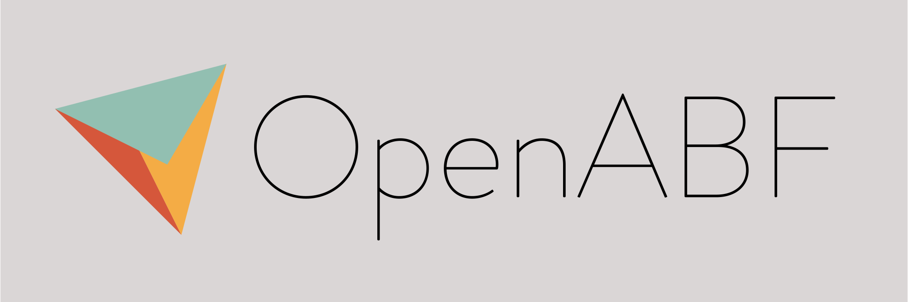

[](https://gitlab.com/educelab/OpenABF)

**OpenABF** is a single-header C++ library of angle-based flattening algorithms.
The templated interface is designed for simple out-of-the-box use, and 
integration with existing geometric processing pipelines is quick and easy.

## Dependencies
- C++14 compiler
- [Eigen 3.3+](http://eigen.tuxfamily.org/)
- CMake 3.15+ (optional)

## Usage
The following example demonstrates how to construct and parameterize a mesh 
with OpenABF: 
 
```c++
#include <OpenABF/OpenABF.hpp>

// Alias algorithms for convenience
using ABF = OpenABF::ABFPlusPlus<float>;
using LSCM = OpenABF::AngleBasedLSCM<float, ABF::Mesh>;

// Make a triangular pyramid mesh
auto mesh = ABF::Mesh::New();
mesh->insert_vertex(0, 0, 0);
mesh->insert_vertex(2, 0, 0);
mesh->insert_vertex(1, std::sqrt(3), 0);
mesh->insert_vertex(1, std::sqrt(3) / 3, 1);

mesh->insert_face(0, 3, 1);
mesh->insert_face(0, 2, 3);
mesh->insert_face(2, 1, 3);

// Print original coordinates
for (const auto& v : mesh->vertices()) {
    std::cout << v->idx << ": " << v->pos << std::endl;
}

// Compute parameterized angles
ABF::Compute(mesh);

// Compute mesh parameterization from angles
LSCM::Compute(mesh);

// Print new coordinates
for (const auto& v : mesh->vertices()) {
    std::cout << v->idx << ": " << v->pos << std::endl;
}
```

**Note:** The `HalfEdgeMesh` class 
[currently assumes](https://gitlab.com/educelab/OpenABF/-/issues/4) that the 
surface has a boundary, is manifold, and that the winding order of all faces is 
the same. Care should be taken that this assumption is not violated when 
constructing your mesh.

## Documentation
Visit our full library documentation [here](https://educelab.gitlab.io/OpenABF/docs/).

## Installation
### CMake
This project can be configured and installed using the CMake build system:

```shell
mkdir build
cmake -S . -B build/
cmake --install build/
```

This will install the OpenABF header(s) to your system include path and provide 
an easy method for including OpenABF inside of your own CMake project:

```cmake
# Find OpenABF libraries
find_package(OpenABF REQUIRED)

# Link to an executable
add_executable(MyTarget main.cpp)
target_link_libraries(MyTarget OpenABF::OpenABF)
```
  
**Note:** For best performance, configure your CMake project with the 
`-DCMAKE_BUILD_TYPE=Release` flag.

#### Configuration
The OpenABF CMake project provides a number of flags for configuring the 
installation:
- `OPENABF_MULTIHEADER`: Install the multi-header version of OpenABF 
  (Default: OFF)
- `OPENABF_BUILD_EXAMPLES`: Build example applications. (Default: OFF)
- `OPENABF_BUILD_TESTS`: Build project unit tests. This will download and build
  the Google Test framework. (Default: OFF)
- `OPENABF_BUILD_DOCS`: Build documentation. Dependencies: Doxygen, Graphviz
  (optional). Unavailable if Doxygen is not found. (Default: OFF)

#### FetchContent (CMake 3.11+)
Another option for providing OpenABF to your project is by using CMake's 
[FetchContent module](https://cmake.org/cmake/help/latest/module/FetchContent.html):

```cmake
include(FetchContent)
FetchContent_Declare(
  openabf
  GIT_REPOSITORY https://gitlab.com/educelab/OpenABF.git
  GIT_TAG v1.0
)

# Populate the project but exclude from All targets
FetchContent_GetProperties(openabf)
if(NOT openabf_POPULATED)
  FetchContent_Populate(openabf)
  add_subdirectory(${openabf_SOURCE_DIR} ${openabf_BINARY_DIR} EXCLUDE_FROM_ALL)
endif()
```

This downloads the OpenABF source code and adds it to your CMake project as a 
subproject. Link it against your targets as you would any library added with 
`find_package`:

```cmake
add_executable(MyTarget main.cpp)
target_link_libraries(MyTarget OpenABF::OpenABF)
```

### Manual
Copy and paste the contents of `single_include/` to your project or include 
path. As OpenABF depends upon the Eigen library, you will also need to add the 
Eigen headers to your include path:

```shell
g++ -I /path/to/eigen/ -std=c++14 -DNDEBUG -O3 main.cpp -o main
```

**Note:** For best performance, compile your application with the `-DNDEBUG -03`
preprocessor definitions.

### Compilation on Windows

For many legacy reasons, the Microsoft Visual C++ compiler (MSVC) is not 
automatically conformant with the C++ standard in all cases. This may lead to 
the following issues when compiling against OpenABF.

**Note:** As this project only supports C++14 and up, you should always compile 
with at least `/std:c++14` or `/std:c++17`.

#### Undeclared identifier errors

At the time of this writing, MSVC does not automatically recognize the 
alternative boolean operators `and`, `or`, and `not`. There are multiple ways to 
fix this issue.

- **Compile with the `/permissive-` flag:** This flag enables C++ language 
conformance for the entire compilation. This is currently Microsoft's suggested 
method for enabling the alternative operators, and is added by default when 
creating new projects in Visual Studio 2017 version 15.5 and later (but not when 
using MSVC on the command line). Since the `/permissive-` flag enables strict 
C++ conformance for the entire project (it enables much more than just operator 
support), it may lead to other compilation problems in existing code.
[See the flag documentation](https://learn.microsoft.com/en-us/cpp/build/reference/permissive-standards-conformance) 
to decide if this is the right solution for your project.

- **Include `iso646.h`:** This header file provides definitions for the 
alternative operators and should be included before including OpenABF. This 
was Microsoft's previous recommendation for enabling alternative operator 
support. It may have fewer side effects in existing code bases than 
the `/permissive-` flag.

#### Static assert: C++ standard >= C++14 not detected

A few places in OpenABF use the `__cplusplus` macro to check the current C++ 
standard library version. When this macro does not indicate at least C++14, we 
raise a static assert: `C++ standard >= C++14 not detected`. By default, MSVC 
defines this macro as `199711L`, which results in an assertion error. To fix 
this issue, compile with the `/Zc:__cplusplus` flag. This flag was added in 
Visual Studio 2017 version 15.7. It **is not** enabled by the`/permissive-` flag 
and must be added separately. 
[See the flag documentation](https://learn.microsoft.com/en-us/cpp/build/reference/zc-cplusplus) 
for more information.

## Contributors
OpenABF is glad to welcome contributors of all skill sets. If you have found a 
bug or wish to contribute a new feature, please see 
[CONTRIBUTING](CONTRIBUTING.md) for more information on how to get started.

### Updating the single-header file
OpenABF is deployed as a single-header library, but is developed as a 
multi-header library. All code changes should be made to the multi-header 
files in `include/OpenABF/`. Before your Merge Request can be accepted, please 
update the single-header file with your changes by running the following 
command from the root of the source directory:

```shell
python3 thirdparty/amalgamate/amalgamate.py -c single_include.json -s .
```

## License
OpenABF is licensed under [the Apache 2.0 license](LICENSE). This allows you to
use OpenABF freely in open source or proprietary software. However, any software
released in source or binary form must include and preserve a readable copy of
the attributions provided in [NOTICE](NOTICE).

The OpenABF logo and banner graphic are by Seth Parker (EduceLab, University
of Kentucky) and are licensed under
[CC BY-NC-SA 4.0](http://creativecommons.org/licenses/by-nc-sa/4.0/).

## Citation
If you use OpenABF in your research, please cite this repository in your publication using [our Zenodo record](https://doi.org/10.5281/zenodo.4483858).

## References
This project implements data structures and algorithms derived from the 
following publications:
* Alla Sheffer and Eric de Sturler. Parameterization of faceted surfaces for meshing using angle-based flattening. _Engineering with Computers_, 17(3):326–337, 2001.
* Bruno Lévy, Sylvain Petitjean, Nicolas Ray, and Jérome Maillot. Least squares conformal maps for automatic texture atlas generation. _ACM Transactions on Graphics (TOG)_, 21(3):362–371, 2002.
* Alla Sheffer, Bruno Lévy, Maxim Mogilnitsky, and Alexander Bogomyakov. Abf++: fast and robust angle based flattening. _ACM Transactions on Graphics (TOG)_, 24(2):311–330, 2005.
* S. Marschner, P. Shirley, M. Ashikhmin, M. Gleicher, N. Hoffman, G. Johnson, T. Munzner, E. Reinhard, W.B. Thompson, P. Willemsen, and B. Wyvill. _Fundamentals of computer graphics._ 4th edition, 2015.
